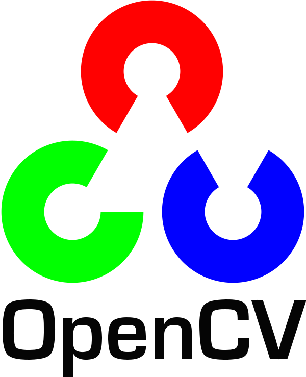

## Languages and Tools

### Mech

- Soliwo

### Hardware, Low Layer

- stm
- systemverilog

- verilog
- riscv

### Server, Back End

 

### Front End

### Application

### Computational Science

 
    

### Programing Tools 

- vscode

